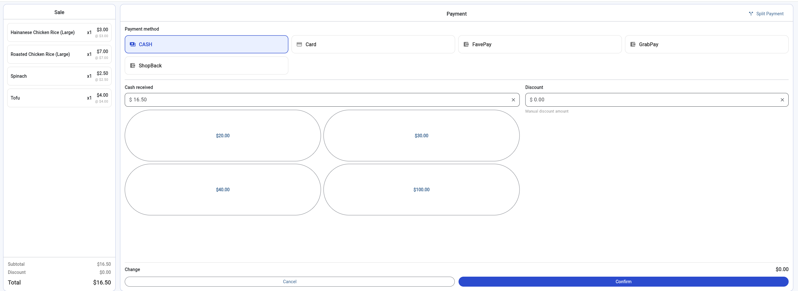
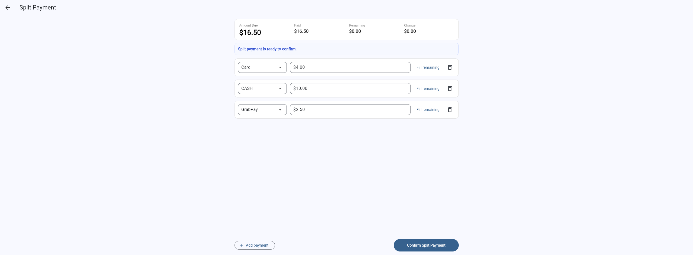

## Payment Flow

A payment workflow designed for POS checkout operations.

### Highlights
- Multiple payment methods
- Cash received and change calculation
- Manual discount input
- Quick cash amount buttons
- Split payment support
- Remaining balance and change tracking

### Screenshots

### Code Sample

[View payment flow snippet](code-samples/payment_flow_snippet.dart)
